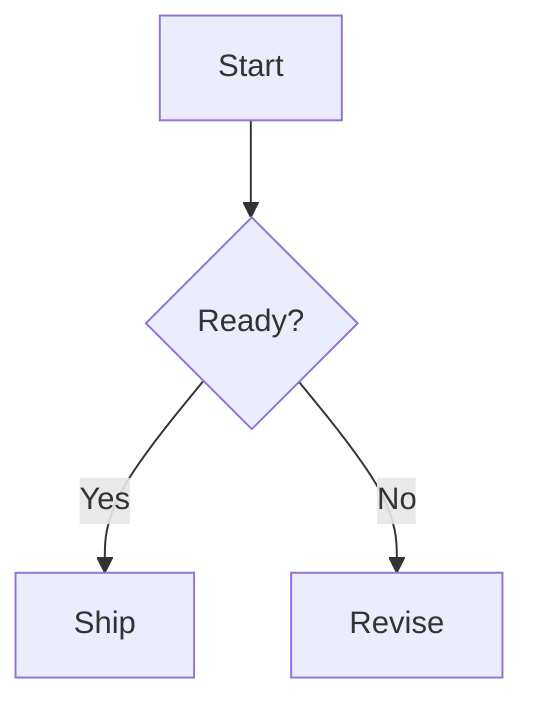

# SiYuan Markup Guide for the CLI

Use Markdown strings with `siyuan-sisyphus block append`, `block prepend`, `block insert`, or `fs write`.

Quick write examples:

```bash
siyuan-sisyphus block append --parent-id "<doc-id>" --data-type markdown --data "## Heading

Paragraph."
```

```bash
siyuan-sisyphus fs write --path "/Notebook/Doc" --markdown "# Title

Initial content."
```

For long content, pass a shell variable or file-expanded argument from the user's environment only when that is appropriate for the shell session. Keep examples in skills concise and inspect the actual result after writing.

## Inline Markup

```markdown
**bold**, *italic*, <u>underline</u>, ~~delete~~, ==mark==
<sup>superscript</sup>, <sub>subscript</sub>, <kbd>Ctrl</kbd>+<kbd>S</kbd>
`inline code`, #tag#, $a^2 + b^2 = c^2$
```

Color examples:

```markdown
**Color 1**{: style="color: var(--b3-font-color1); background-color: var(--b3-font-background1);"}
**Color 2**{: style="color: var(--b3-font-color2); background-color: var(--b3-font-background2);"}
```

Common variables: `--b3-font-color1` through `--b3-font-color13` and `--b3-font-background1` through `--b3-font-background13`.

## Headings

```markdown
# Heading 1
## Heading 2
### Heading 3
#### Heading 4
##### Heading 5
###### Heading 6
```

CLI:

```bash
siyuan-sisyphus block append --parent-id "<doc-id>" --data-type markdown --data "## Heading 2"
```

## Lists

```markdown
- Item A
  - Nested A1
  - Nested A2
- Item B

1. First
   1. Nested first
   2. Nested second
2. Second

- [X] Done
- [ ] Todo
```

CLI:

```bash
siyuan-sisyphus block append --parent-id "<doc-id>" --data-type markdown --data "- [ ] Review notes
- [ ] Publish summary"
```

## Tables

```markdown
| Name | Status | Due |
| --- | --- | --- |
| Draft | In progress | 2026-05-15 |
| Review | Todo | 2026-05-16 |
```

CLI:

```bash
siyuan-sisyphus block append --parent-id "<doc-id>" --data-type markdown --data "| Name | Status |
| --- | --- |
| Draft | Done |"
```

For real database behavior, use the `siyuan-sisyphus-database` skill and the `av` CLI commands instead of Markdown tables.

## Code Blocks

````markdown
```typescript
export function hello(name: string) {
  return `Hello, ${name}`;
}
```
````

CLI:

````bash
siyuan-sisyphus block append --parent-id "<doc-id>" --data-type markdown --data '```typescript
export function hello(name: string) {
  return `Hello, ${name}`;
}
```'
````

## Blockquotes and Callouts

```markdown
> Important note
> Continued note
```

Simple callout-style block:

```markdown
> **Note**
>
> Keep the key decision and evidence together.
```

CLI:

```bash
siyuan-sisyphus block append --parent-id "<doc-id>" --data-type markdown --data "> **Note**
>
> Keep the key decision and evidence together."
```

## Math

Inline:

```markdown
Euler identity: $e^{i\pi} + 1 = 0$
```

Block:

```markdown
$$
\int_0^1 x^2 dx = \frac{1}{3}
$$
```

CLI:

```bash
siyuan-sisyphus block append --parent-id "<doc-id>" --data-type markdown --data "$$
\int_0^1 x^2 dx = \frac{1}{3}
$$"
```

## Diagrams

Mermaid:

````markdown

````

ECharts:

````markdown
```echarts
{
  "xAxis": { "type": "category", "data": ["A", "B", "C"] },
  "yAxis": { "type": "value" },
  "series": [{ "type": "bar", "data": [3, 7, 5] }]
}
```
````

CLI:

````bash
siyuan-sisyphus block append --parent-id "<doc-id>" --data-type markdown --data '```mermaid
flowchart TD
  A[Start] --> B[Done]
```'
````

## Super Blocks

Horizontal layout:

```markdown
{{{row
Left paragraph

Right paragraph
}}}
```

Vertical layout:

```markdown
{{{col
Top paragraph

Bottom paragraph
}}}
```

CLI:

```bash
siyuan-sisyphus block append --parent-id "<doc-id>" --data-type markdown --data "{{{row
Left paragraph

Right paragraph
}}}"
```

## Embeds and Query Blocks

Dynamic query block:

```markdown
{{SELECT id, content FROM blocks WHERE content LIKE '%TODO%' LIMIT 20}}
```

CLI:

```bash
siyuan-sisyphus block append --parent-id "<doc-id>" --data-type markdown --data "{{SELECT id, content FROM blocks WHERE content LIKE '%TODO%' LIMIT 20}}"
```

## Images and Assets

Images need real asset paths:

```markdown

```

Upload first when the image is local, after user approval:

```bash
siyuan-sisyphus file upload-asset --assets-dir-path "/assets/" --local-file-path "/absolute/path/image.png"
siyuan-sisyphus block append --parent-id "<doc-id>" --data-type markdown --data ""
```

## Insert Methods

Append to document end:

```bash
siyuan-sisyphus block append --parent-id "<doc-id>" --data-type markdown --data "Content"
```

Prepend to document start:

```bash
siyuan-sisyphus block prepend --parent-id "<doc-id>" --data-type markdown --data "Content"
```

Insert before a block:

```bash
siyuan-sisyphus block insert --next-id "<block-id>" --data-type markdown --data "Content"
```

Insert after a block:

```bash
siyuan-sisyphus block insert --previous-id "<block-id>" --data-type markdown --data "Content"
```

Create or overwrite a whole document:

```bash
siyuan-sisyphus fs write --path "/Notebook/New Doc" --markdown "# Title

Content."
```

## Verification

After writing rich markup, verify with one of:

```bash
siyuan-sisyphus fs read --path "/Notebook/Doc"
siyuan-sisyphus block get-kramdown --id "<block-id>"
siyuan-sisyphus document get-doc --id "<doc-id>" --mode markdown
```

Avoid `block update` for large multi-line markup; use append, prepend, insert, or `fs write` instead.
